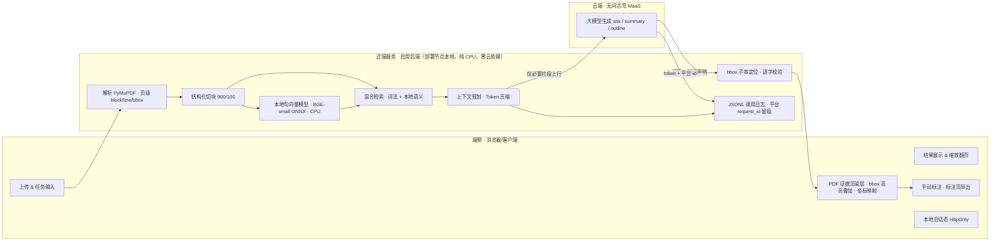

# 架构说明

研答通是一个**端云分层协同**的文档助手：解析、切块、**本地语义编码**、混合检索、上下文压缩、证据定位等"重而可本地化"的计算放在端侧/近端完成——其中**近端跑一个本地句向量模型（BGE-small-zh-v1.5 ONNX，纯 CPU、零云依赖）做语义编码与词法+语义混合检索**，这是真实的端侧 ML 算力实体，而非仅规则算法；只把命中任务意图的**必要片段**上云，交由无问芯穹 MaaS 大模型**生成**；回答再回到端侧做 PDF 内证据回链。这正回应赛题一"端侧/云端协同应用"的命题——**小模型在端理解、大模型在云生成**，且有量化收益（长文档 `ask` 平均只上送原文约 **13%** 的 token，峰值压到 **6.9%**）。

## 端云职责划分（诚实口径）

| 层 | 位置 | 职责 |
|---|---|---|
| 端侧 | 浏览器/客户端 | 上传与任务输入、结果展示、**PDF 证据 bbox 高亮叠加与坐标映射**、**手动标注与标注页导出**、缩放翻页、本地会话态（HttpOnly cookie） |
| 近端服务 | 应用后端（部署节点本地，纯 CPU、零云依赖，非云端大模型） | PDF 解析（保留页级 block/line/bbox）、结构化切块、**本地句向量编码（BGE-small-zh-v1.5 ONNX，CPU）**、**词法 + 本地语义混合检索**、**上下文规划与 Token 压缩**、bbox 子串定位与逐字证据校验、JSONL 调用日志 |
| 云端 | 无问芯穹 MaaS | `ask / summary / outline` 大模型**生成** |

> 诚实标注（一）：PDF 页面图像由近端服务用 PyMuPDF 栅格化后下发，端侧负责坐标映射与高亮/标注的交互与渲染——端侧做的是"证据呈现 + 交互计算"，不夸大为"端侧大模型推理"。
>
> 诚实标注（二，语义检索口径）：近端的本地句向量模型是**真实在本机 CPU 上运行的 ML 前向推理、零云依赖**，物理上可下沉到端侧/边缘节点。但我们**不声称**它在我们高度优化的词法检索基准上"显著提升"准确率——离线对照中两者基本持平（43/43 可答题页命中、23 条改写题各 19/23 同分、零回归，详见 `evidence/reports/edge_hybrid_eval.md`）。它的价值在于：① 真实的端侧 ML 算力实体（回应赛题"端侧/云端协同"主题）；② 对未知/改写措辞、词法弱区（英文公式、多语混排）的语义补召回；③ 不依赖手写规则的可扩展召回。**②的实测支撑（2026-06-02 A/B）**：在 176 道全新泛化题上做端侧开/关对照，端侧把"该答却拒"的过度拒答从 **6 降到 1**（3 例经人复核为真补召回——Attention 注意力公式 `softmax(QK^T/√d_k)V`、表1复杂度、多语合同日语截止日，均词法弱区/语义强区），且**零新增编造**；净增益不大（88.6%→89.2%），故诚实定位为"补词法弱区召回"而非"显著提升"（见 `evidence/reports/edge_ab_generalization_20260602.md`）。模型缺失或失败时**自动回退纯词法**，现场绝不因端侧组件崩盘。

## 协同收益（可量化）

**支柱一 · 真实端侧 ML 算力实体**：近端跑一个本地句向量模型（BGE-small-zh-v1.5 ONNX，纯 CPU、零云依赖）做语义编码与混合检索——这是赛题一"端侧/云端协同"主题的**真实技术实体**（小模型在端理解、大模型在云生成），不是"把云端的活挪个位置"的叙事；物理上可下沉到端侧/边缘运行（**本机实测：权重 90.4MB、每查询编码 ~9ms、纯 CPU 零云，见 `edge_latency_20260603.md`**；建索引为一次性/文档成本、走 warmup 预建）。诚实口径：它与我们高度优化的词法检索在固定基准上**持平、零回归**（见 `edge_hybrid_eval.md`）；在 176 题全新泛化集上实测**补词法弱区召回**（过度拒答 6→1，3 例人复核验证、零新增编造，见 `edge_ab_generalization_20260602.md`），净增益不大不夸为"显著提升"。价值在实体本身 + 难文档补召回，不刷分。

**支柱二 · 就近压缩（可量化）**

- 近端"解析 → 切块 → 按任务意图选片段"的三层预处理，让**只有必要上下文上云**：长文档 `ask` 平均节省 **86.6%** input token，峰值 **93.1%**（Attention 论文 `10,263 → 704` tokens）。
- 这条数据在赛题里双线计分：既命中加分项 #4（Token 压缩技术），又是"端侧/云端协同能力"的直接证据——端侧/近端就近降载、云端只接收高密度上下文，等价于降低上行带宽与云端 input 计费。
- 阈值论点：当文档再长 5–10 倍（论文集/报告合集）超过 32k 上下文窗口时，端侧压缩从"加分项"变成"能跑通的前提"。

## 关键设计点

1. **端云分层协同，就近压缩**
- 解析、切块、检索、上下文规划在端侧/近端完成，只上送必要片段到无问芯穹云端推理
- Token 压缩是协同的量化收益，而非单纯的成本优化

2. **可解释性优先 · 引用不可伪造**
- `ask` 返回 `used_chunk_ids` 与 `evidence_quotes`，后端对每条 quote 做**原文子串校验**，校验不过即丢弃——引用无法编造
- citation 可回到 PDF 原页做 bbox 高亮与旁证展示
- `summary / outline` 提供来源片段（溯源提示，语义弱于 `ask`）

3. **检索/模型双层拒答**
- 检索层无命中 → `retrieval_gate` 直接拒答，离题问题在生成前就被拦截（省 token）
- 检索命中但模型判定无依据 → LLM 层 `llm_refused` 二次拒答；低置信候选交模型复核，未给可验证证据则拒答

4. **单层 agentic 检索循环**
- `ask` 在主链路内做受控 agentic RAG：检索 → 模型自评证据是否充分 → 不足则**有界二次重试**（`iter≤2`，需要新证据时改写 `followup_query` 补检索）
- 全程不破坏拒答与证据回链契约；`agent_iterations` 落日志（真实日志中约 1/4 的 `ask` 触发了二轮自评）。**诚实口径**：改写补检索分支已实现且单测覆盖，但固定 demo 集上模型多为单轮收敛、触发的二轮也多为同上下文证据复核，故生产日志 `query_rewrites` 多为空——我们把它定位为"有界自评重试"，不当作"现场可逐条核验改写"的卖点

5. **证据可沉淀 · 平台可对账**
- 结果进入 JSONL 日志（含 token、本地 request_id 与**无问芯穹平台 request_id**）、统计与 evidence 目录
- 平台 request_id 可与 infini-ai 控制台调用记录逐条对账，支撑决赛"MaaS API 调用记录"证明材料
