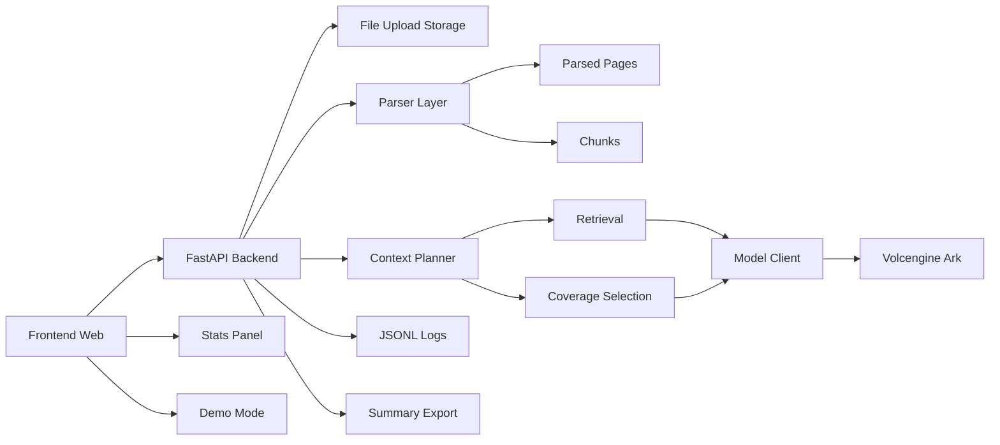

# 架构说明

## 说明

- Frontend 负责上传、任务输入、结果展示、统计面板与 demo 模式
- Backend 负责解析、分块、上下文编排、检索、模型调用和日志留存
- Parser 保留页级结构
- Chunk 层为检索和后续引用打基础
- Context Planner 决定不同任务如何选择上下文
- Volcengine Ark 负责生成能力
- JSONL Logs 和导出脚本负责证据沉淀

## 关键设计点

1. **先闭环，后增强**
- 第一阶段先完成上传、解析、生成、展示和日志闭环
- 第二阶段再逐步补齐页级结构、分块、检索和引用

2. **云端优先，工程先行**
- 早期把重心放在工程闭环，而不是本地大模型部署
- 先验证真实场景下的上传、问答和提纲任务链路

3. **可解释性优先**
- `ask` 支持结构化引用依据
- `summary / outline` 支持来源片段
- 日志与统计面板帮助验证运行状态和质量

4. **证据可沉淀**
- 结果不只在前端展示，还会进入日志、统计和 evidence 目录
- 便于后续做比赛材料和答辩说明

