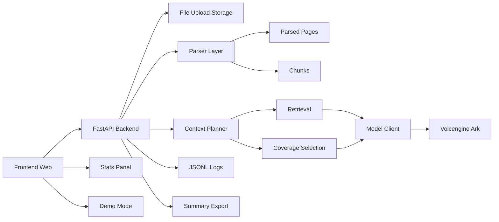

# 架构说明

## 说明

- Frontend 负责上传、任务输入、结果展示、统计面板与 demo 模式
- Backend 负责解析、分块、上下文编排、检索、模型调用和日志留存
- Parser 保留页级结构
- Chunk 层为检索和后续引用打基础
- Context Planner 决定不同任务如何选择上下文
- Volcengine Ark 负责生成能力
- JSONL Logs 和导出脚本负责证据沉淀

