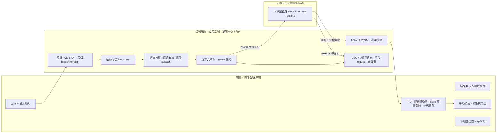

# 架构说明

研答通是一个**端云分层协同**的文档助手：把解析、切块、检索、上下文压缩、证据定位等"重而可本地化"的预处理放在端侧/近端完成，只把命中任务意图的**必要片段**上云，交由无问芯穹 MaaS 大模型推理；回答再回到端侧做 PDF 内证据回链。这正回应赛题一"端侧/云端协同应用"的命题——协同不是口号，而是有量化收益（长文档 `ask` 平均只上送原文约 **13%** 的 token，峰值压到 **6.9%**）。

## 端云职责划分（诚实口径）

| 层 | 位置 | 职责 |
|---|---|---|
| 端侧 | 浏览器/客户端 | 上传与任务输入、结果展示、**PDF 证据 bbox 高亮叠加与坐标映射**、**手动标注与标注页导出**、缩放翻页、本地会话态（HttpOnly cookie） |
| 近端服务 | 应用后端（部署节点本地，非云端大模型） | PDF 解析（保留页级 block/line/bbox）、结构化切块、词法检索 + 意图 fallback、**上下文规划与 Token 压缩**、bbox 子串定位与逐字证据校验、JSONL 调用日志 |
| 云端 | 无问芯穹 MaaS | `ask / summary / outline` 大模型推理 |

> 诚实标注：PDF 页面图像由近端服务用 PyMuPDF 栅格化后下发，端侧负责坐标映射与高亮/标注的交互与渲染——端侧做的是"证据呈现 + 交互计算"，不夸大为"端侧大模型推理"。

## 协同收益（可量化）

- 近端"解析 → 切块 → 按任务意图选片段"的三层预处理，让**只有必要上下文上云**：长文档 `ask` 平均节省 **86.6%** input token，峰值 **93.1%**（Attention 论文 `10,263 → 704` tokens）。
- 这条数据在赛题里双线计分：既命中加分项 #4（Token 压缩技术），又是"端侧/云端协同能力"的直接证据——端侧/近端就近降载、云端只接收高密度上下文，等价于降低上行带宽与云端 input 计费。
- 阈值论点：当文档再长 5–10 倍（论文集/报告合集）超过 32k 上下文窗口时，端侧压缩从"加分项"变成"能跑通的前提"。

## 关键设计点

1. **端云分层协同，就近压缩**
- 解析、切块、检索、上下文规划在端侧/近端完成，只上送必要片段到无问芯穹云端推理
- Token 压缩是协同的量化收益，而非单纯的成本优化

2. **可解释性优先 · 引用不可伪造**
- `ask` 返回 `used_chunk_ids` 与 `evidence_quotes`，后端对每条 quote 做**原文子串校验**，校验不过即丢弃——引用无法编造
- citation 可回到 PDF 原页做 bbox 高亮与旁证展示
- `summary / outline` 提供来源片段（溯源提示，语义弱于 `ask`）

3. **检索/模型双层拒答**
- 检索层无命中 → `retrieval_gate` 直接拒答，离题问题在生成前就被拦截（省 token）
- 检索命中但模型判定无依据 → LLM 层 `llm_refused` 二次拒答；低置信候选交模型复核，未给可验证证据则拒答

4. **单层 agentic 检索循环**
- `ask` 在主链路内做受控 agentic RAG：检索 → 模型自评证据是否充分 → 不足则产出 `followup_query`，近端补检索新片段后再问一次，最多 2 轮收敛
- 全程不破坏拒答与证据回链契约；`agent_iterations / query_rewrites` 落日志，agent 行为可核验

5. **证据可沉淀 · 平台可对账**
- 结果进入 JSONL 日志（含 token、本地 request_id 与**无问芯穹平台 request_id**）、统计与 evidence 目录
- 平台 request_id 可与 infini-ai 控制台调用记录逐条对账，支撑决赛"MaaS API 调用记录"证明材料
